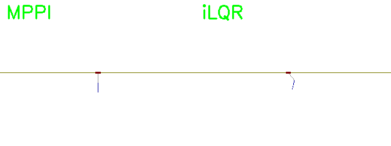

# Trajectory Optimization for Double Inverted Pendulum using iLQR validated against MPPI

This project implements trajectory optimization for a double inverted pendulum on a cart, using two advanced control algorithms:

- **iLQR (iterative Linear Quadratic Regulator)** with MPC-style warm starting, adaptive regularization, and real-time replanning.
- **MPPI (Model Predictive Path Integral Control)** based on stochastic sampling.

The simulation environment is built with **PyBullet**, and all controllers are implemented from scratch using **NumPy** and **PyTorch**.

This project was developed as part of **ROB 599: Robot Learning for Planning and Control** at the University of Michigan.

---

## 📦 Installation Instructions

First, clone the repository:

```bash
git clone https://github.com/kushpatel19/Trajectory-Optimization.git
cd Trajectory-Optimization
```
Then install the required dependencies by running the install script:

```bash
./install.sh
```
---

## 🚀 Running the Simulation

After installation, you can run the main demo simulation with

```bash
python demo.py
```
This script will:

- Run both the iLQR and MPPI controllers on the double inverted pendulum task.
- Save simulation results as GIFs (`mppi.gif`, `ilqr.gif`, `comparison.gif`).
- Show a real-time visualization comparing MPPI and iLQR side-by-side.

---
## 🎯 Outcome

### Random Action Simulation

Below is the behavior of the double inverted pendulum system under random control actions:

<p align="center">
  
</p>

### MPPI vs iLQR Controller Comparison

The following visualization shows the comparison of MPPI and iLQR controllers in stabilizing the pendulum:

<p align="center">
  
</p>

Stay Tuned for better results:)
